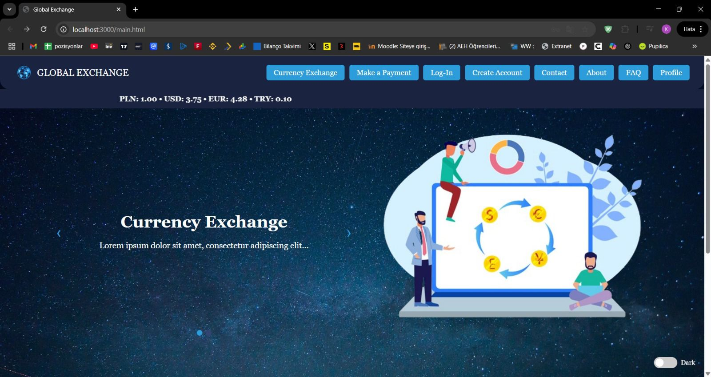

# Currency Exchange App

Full-stack Currency Exchange Application with Authentication, API Integration and Payment System.

## Project Purpose
This project was built to demonstrate full-stack development skills including authentication, API integration, database management, and secure user handling.

It is suitable as a junior-level portfolio project.

## Features
- User Registration & Login (JWT Authentication)
- Password Hashing with Bcrypt
- Real-time Currency Exchange Rates (API)
- Wallet System
- Payment Simulation
- User Profile Management

## Tech Stack
**Frontend:**  
HTML, CSS, JavaScript  

**Backend:**  
Node.js, Express.js  

**Database:**  
SQLite (Sequelize ORM)

**Authentication:**  
JWT, Bcrypt  

## Screenshots



## Installation

```bash
git clone https://github.com/OrhanIzmirli/currency-exchange-app.git
cd currency-exchange-app/backend
npm install
npm start
---

## API Endpoints

POST /api/auth/register  
POST /api/auth/login  
GET /api/user/profile  
GET /api/exchange/rates  

---

## Author

Orhan Izmirli  
Computer Science Student – Warsaw, Poland  
LinkedIn: https://www.linkedin.com/in/orhan-izmirli-689441307/

